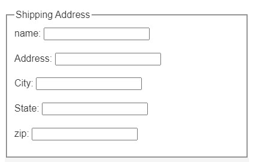

## 프론트엔드 >> HTML 프로그래밍 기초

### 4. 입력 양식

이번 강좌에서는 웹에서 사용자 입력을 처리하기 위한 입력양식(form)의 종류와 사용법을 배우게 됩니다. 회원가입이나 게시글 포스팅 등 무언가를 입력해서 서버로 전송하거나 상품 주문시 옵션을 선택하고 주소를 입력하고 주문버튼을 누르는 등의 모든 화면들이 입력 양식에 해당 합니다.

이 강의를 통해 여러 입력양식 태그를 이해하고 원하는 양식을 디자인 할 수 있으며 입력양식과 서버의 연동 원리를 이해할 수 있게 됩니다.

#### 01: 입력 양식 개요
입력 양식은 웹에서 사용자에게 정보를 입력 받을 때 사용하는 사용자 인터페이스(UI)를 말합니다. 
기본적으로 `<form>`태그가 사용되며 `<form>`태그 내부에 다양한 형식의 입력양식 태그들을 사용해 화면을 구성하게 됩니다.

* 기본적인 텍스트 입력, 선택, 버튼, 파일첨부 등이 가능.
* 버튼의 경우 이벤트 처리를 위해 자바스크립트와 연동.
* 파일 첨부의 경우 서버에서 파일 업로드를 위한 별도 구현이 되어 있어야 함.

다음은 쇼핑몰등에서 상품 주문시 배송지 주소를 입력하는 입력양식 예 입니다.
```html
<form action="#" method="get">
  <fieldset>
    <legend>Shipping Address</legend> 
  <p>name: <input type="text" name="Name" /></p>
  <p>Address: <input type="text" name="Adress" /></p>
  <p>City:  <input type="text" name="City" ></p>
  <p>State: <input type="text" name="Stat" /></p>
  <p>zip: <input type="text" name="Zip" /></p>
</fieldset>
</form>
```

**실행 결과 보기**



```


웹 입력 양식 동작 구조
<form> 태그를 통해 작성된 입력 양식은 최종적으로 입력 데이터를 서버로 전송해야 합니다. 이때 사용되는 주요 속성은 method와 action입니다. method는 웹 서버와에 데이터를 전달하는 방법을 지정하며 get과 post 방식이 존재합니다. action은 입력 받은 값을 전송할 서버의 프로그램 URL을 지정하게 됩니다.


<form> 태그
<form action="데이터를 전송할 URL" method="전송방법">
  <input type="text"> 
  ...
</form>
<form>은 입력양식의 최상위 요소로 다른 입력 양식을 포함.
action 속성은 데이터를 전송할 URL로 보통 서버의 프로그램과 연결되는 주소.
method 는 HTTP 프로토콜상의 전송방법으로 대표적으로 GET과 POST가 있음.
GET
기본적으로 GET은 서버에 대이터를 요청할때 사용. 양식 데이터를 제출할 때, 기본 메소드는 GET 방식.
GET을 사용하면 제출된 양식 데이터가 페이지 주소 필드에 표시됨.
/action_page.php?firstname=Sarang&lastname=Hong
전송할 폼 데이터를 URL에 name=value의 쌍으로 추가.
URL의 길이는 제한되어 있음. (브라우저에 따라 다름)
중요한 데이터를 전송할때 GET을 사용하면 안됨. (URL에 표시됨)
검색엔진에 검색 단어를 전송하는것 같이 서버 프로그램을 호출할때 파라미터 형태로 사용.
POST
회원가입이나 게시판에 글을 쓰는것 같이 데이터를 서버에 전송할때 사용.
전송할 폼 데이터에 중요 정보나 개인 정보가 포함되어 있으면 항상 POST 방식사용 권장.
제출된 양식 데이터를 페이지 주소 필드에 표시하지 않음.
POST 방식에는 크기 제한이 없으므로 많은 양의 데이터를 보낼 수 있음.
파일전송은 multipart/form-data 로 전송해야 하며 일반적인 텍스트 데이터 전송과는 다름.

02: 입력 양식 태그
기본적으로는 <input> 태그를 사용하며 type 속성으로 다양한 입력 양식을 정의할 수 있습니다. 그외 <select>, <textarea>, <button> 등의 태그도 사용할 수 있습니다.

Tag	Description
<form>	입력양식 지정을 위한 기본 태그
<input>	여러 유형의 입력 양식을 지정
<textarea>	여러 라인에 걸친 프리 포맷 입력 양식
<label>	입력 양식과 연결되는 텍스트 라벨
<fieldset>	입력 양식들을 그룹으로 묶어주는 태그
<legend>	<fieldset>의 제목을 표시
<select>	드롭다운 박스로 목록중에서 선택할 수 있는 양식
<optgroup>	<select>안에서 목록을 그룹화
<option>	<select> 의 선택 항목 지정
<button>	입력 버튼 생성
<input> 태그
가장 많이 사용하는 입력양식 태그이며 대부분의 입력 기능을 제공 합니다. type속성으로 입력 양식의 종류를 나타내고 name속성으로 서버에 전송될 데이터 이름을 지정 합니다. value 속성은 기본 입력값을 지정할때 사용하고 placeholder는 입력 항목에 대한 설명문을 넣을때 사용 합니다.

<input type="입력 양식 유형" name="입력값 이름" placeholder="설명">
type

필수 속성이며 사용할 수 있는 type은 다음과 같습니다.

text : 텍스트 입력 필드
password : 비밀번호 입력필드
checkbox : 복수 선택 가능한 체크 박스
radio : 복수 선택 불가능한 라디오 버튼 생성
submit : 입력양식을 서버로 전송하기 위한 버튼
reset : 리셋 버튼
button : 일반 버튼
name

입력값에 붙이는 이름으로 서버에서 참조할 수 있는 변수 형태가 됩니다. 일반적으로 입력값을 서버에서 처리할때 사용하게 되며 서버 구현에 따라 데이터베이스 테이블 구조의 엔티티 클래스를 자동으로 매핑하는 경우 엔티티 클래스의 필드 이름과 동일한 이름을 사용해야 합니다.

<input type="text" name="userid">
<input type="assword" name="pwd">
html5 에서는 이외에 특정 데이터 타입에 따라 좀 더 편하게 입력할 수 있는 type 들이 제공됩니다. 예를 들어 color는 색상선택을 위해 별도의 색상선택 박스가 나오게 되고 date 의 경우 날짜 입력을 위해 달력이 나오는 형식입니다. 이들 유형들은 브라우저에 따라 지원이 안되는 경우도 있고 모양이 다르므로 참고하기 바랍니다.

html5 input types

button, checkbox, color, date, datetime-local, email, file, hidden, image, month, number	password, radio, range, reset, search, submit, tel, text, time, url, week


<checkbox>와 <radio> 태그
이들 태그는 여러 항목중에 하나 혹은 중복 선택을 위한 UI를 제공 합니다. checkbox는 여러 항목을 다중으로 선택할 수 있고 radio는 하나만 선택할 수 있습니다. 여러 항목들을 하나의 그룹으로 묶기 위해서는 name 속성을 동일하게 해주어야 합니다.

<input type="radio" name="gender">Male</input>
<input type="radio" name="gender">Female</inut>
<input type="radio" name="gender">Other</inut>

<input tpe="checkbox" name="hobby">Swimming</input>
<input type="checkbox" name="hobby">Traveling</input>
<input type="checkbox" name="hobby">Other</input>
<select> 태그
드롭다운 목록을 제공하는 태그로 화면 공간을 절약하고 여러 항목중 하나 혹은 여러개를 선택할 수 있도록 해주는 입력양식 태그 입니다.

<select name=“cars”>
    <option value=“101”>Benz</option>
    <option value=“102”>BMW</option>
    <option value=“103”>Audi</option>
    <option value=“104”>WolksWagen</option>
</select>
입력항목들은 <option> 태그로 정의 되며 태그사이의 텍스트는 화면에 보여지는 내용을 기술함.
서버로 전송되는 값은 value 속성의 값으로 보여지는 값과 동일하거나 혹은 별도의 값을 정의해도 됨.
예를들어 보여지는 값은 알기 쉬운 상품명이고 서버에 전달될 때는 DB 검색 등을 위해 상품코드를 value에 사용.
다중 선택을 위해서는 <select multiple>과 같이 작성할 수 있으며 이 경우 드롭다운이 아닌 목록이 나타나고 Ctrl을 누르고 선택해야 다중 선택이 됨.
<button> 태그
버튼은 입력양식에서 매우 많이 사용되는 구성요소 입니다. 다만 그냥 버튼을 생성해서는 아무런 동작을 하지 않고 별도의 이벤트 처리와 연동되어야 하므로 실제 활용은 자바스크립트 학습이 필요 합니다.

<button ype=“button” onclick="alert('Hello World!')">Click Me!</button>
<input type=”button”>`과 동일하게 버튼을 생성.
<button>태그 사용시 value 를 사용하지 않고 텍스트를 넣을 수 있음.
<a> 태그등을 <button> 태그와 함께 사용 가능.
CSS 사용시 별도 디자인 적용이 편리함.
type속성을 지정하지 않으면 자동으로 submit 버튼으로 동작하므로 주의.(button, submit, reset 지정가능)
onXXX 이벤트 핸들러 속성으로 해당 이벤트 발생시 자바스크립트 코드 호출 가능.
참고 자료
W3Schools.com HTML 강좌: https://www.w3schools.com/html/default.asp
Mozilla HTML 개발자 문서 : https://developer.mozilla.org/ko/docs/Learn/HTML
Codecademy HTML 무료강좌: https://www.codecademy.com/learn/learn-html
(c) 2019 짧굵배, Contact  
```